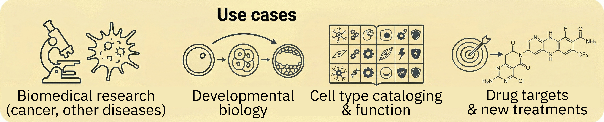
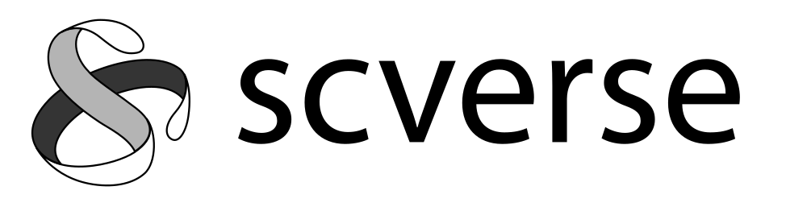
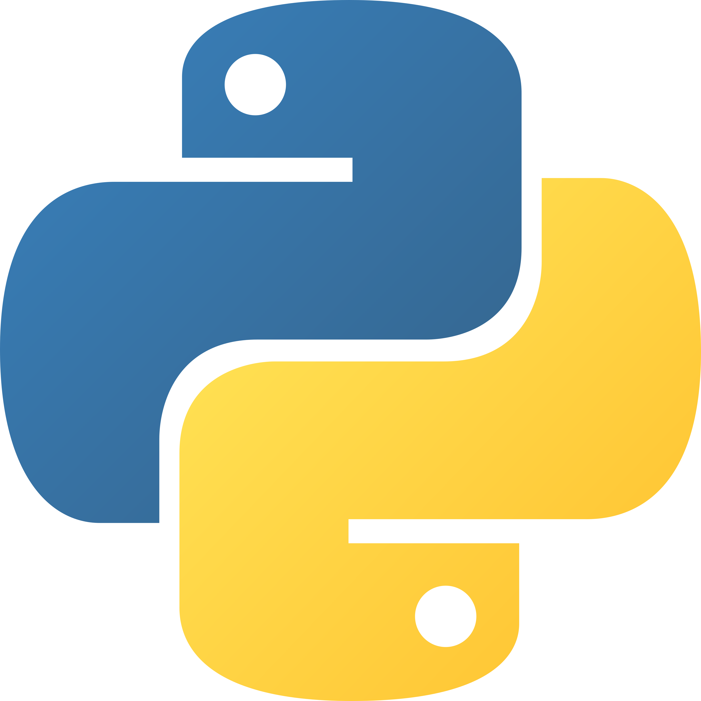
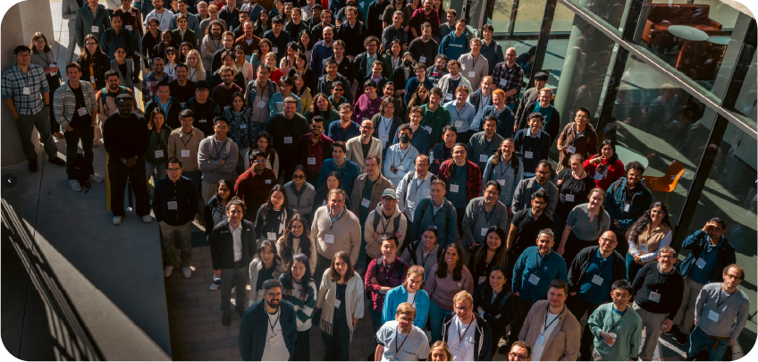
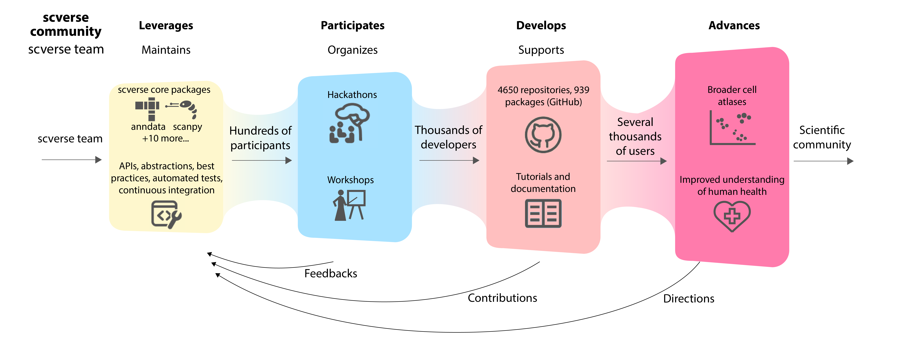
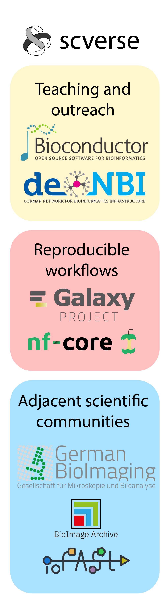
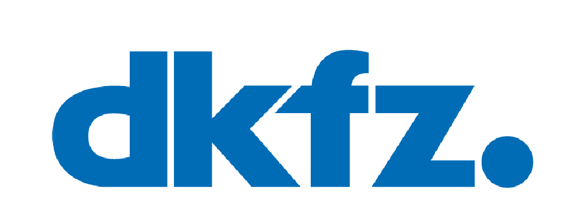
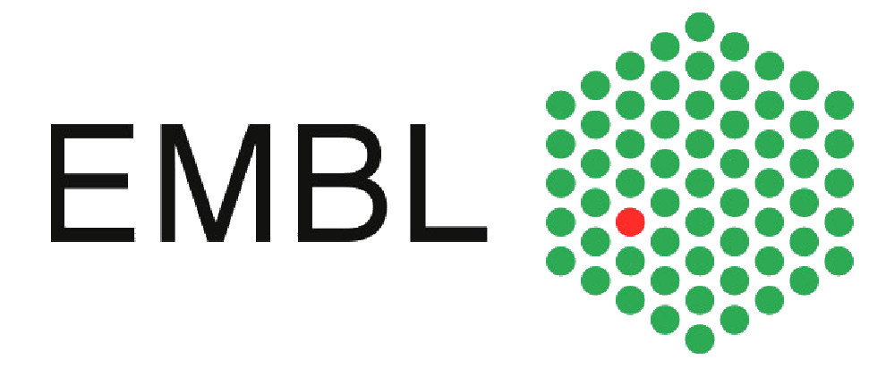
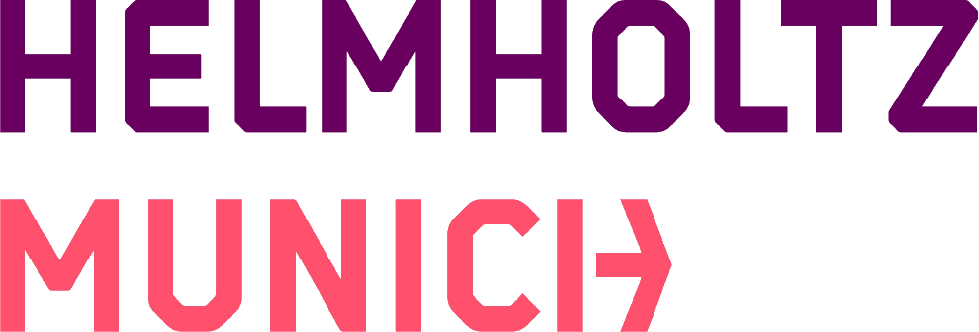

# [scverse: a consortium for community-driven software development for single-cell analysis]{style="font-size: 0.75em;"} {.smaller}

<!-- LEFT COLUMN -->

<strong>Software infrastructures for bioinformatics</strong>

<ul style="margin: 0; padding-left: 1.2em; line-height: 1.4;">
<li>25 years old, >2000 packages</li>
<li>Tens of thousands of users</li>
<li>Broad bioinformatics scope</li>
<li>Biostatistics via R</li>
</ul>

<ul style="margin: 0; padding-left: 1.2em; line-height: 1.4;">
<li>Single-cell + adjacent communities (e.g. image analysis)</li>
<li>Link to modern AI/ML via Python</li>
<li>Bridge to emerging technologies (Rust, CUDA)</li>
</ul>

<!-- RIGHT COLUMN -->

<strong>Workshops/conferences/hackathons</strong>

2nd scverse conference, Nov 2025, Stanford (US)

<!-- BOTTOM PANEL -->

<strong>Software from the scverse community</strong>

107

ecosystem packages

939

dependent packages

4,650

dependent repositories

<strong>A community that learns and grows together</strong>

1,230

Zulip members (discussion platform)

1,708

Pull requests (last 365 days)

72,569

Daily downloads

https://scverse.org/

::: {.notes}
scverse is a consortium for community-driven software development for single-cell analysis, addressing use cases such as single-cell atlases, data repositories, data exchange, multi-omics and spatial integration, and model deployment. In the broader landscape of software infrastructures for bioinformatics, Bioconductor and R have been established for 25 years with over 2,000 packages, tens of thousands of users, a broad bioinformatics scope, and strong biostatistics foundations. scverse complements this with Python, providing a link to modern AI/ML, connections to adjacent communities such as image analysis, and a bridge to emerging technologies like Rust and CUDA. On the community side, we have organized workshops, conferences, and hackathons, including the 2nd scverse conference in November 2025 at Stanford. The scverse community contributes 107 ecosystem packages, with 939 dependent packages and 4,650 dependent repositories on GitHub. We have 1,230 members on our Zulip discussion platform, 1,708 pull requests in the last 365 days, and around 72,569 daily downloads.
:::

# scverse: bridging user and developer experiences for single-cell biology{.smaller}

<!-- For documentation of how to deploy on GitHub pages, see:
https://quarto.org/docs/publishing/github-pages.html
Here, I use the first option: Render to docs
-->

:::: {.columns}
::: {.column width="50%"}
**Users focus: scientific discovery**

- Benefit from easy installation & comprehensive documentation

**Developer focus: removing friction, maintainability**

- Templates (scverse cookiecutter), dependency management, CI/CD, automation

:::
::: {.column width="50%"}
**Bridge users ↔ developers**

- Online support, in-person events
- Developer as a teacher: scientists learn to develop, developers focus on real scientific needs
- Software interoperability: e.g. Python + R/Bioconductor (AnnDataR)
:::
::::

::: {.notes}
scverse bridges users and developers. For users, the goal is to let scientists focus on scientific discovery — with easy installation and comprehensive documentation. For developers, we remove friction through automation: CI/CD, the scverse cookiecutter template, and dependency management. The bridge between these two worlds is built through online support, in-person events, and a teaching philosophy where developers help scientists become developers themselves, and gather crucial feedback in the process. Software interoperability — for instance Python and R/Bioconductor via AnnDataR — ensures broad accessibility. As the operations figure shows, this pipeline flows from the core team maintaining 12 core packages, through hackathons and workshops with hundreds of participants, to thousands of developers producing tutorials and documentation, ultimately advancing scientific discovery.
:::

#  {visibility="hidden"}

# Networking and national infrastructure {.smaller}

:::: {.columns style="font-size: 1.3em;"}
::: {.column width="80%"}
**How can your project benefit from networking with other projects?**

- Optimally exploit shifting paradigms and workflows from AI: e.g., hard and solid core methods, LLM-enhanced glue and user interfacing
- Share and learn from each other: what works, what doesn't

**How can your project contribute to a national integrated structure for research software?**

- Broader collaboration on modular, reusable components for shared problems

**What should a national integrated structure for research software achieve?**

- European digital sovereignty to have the tools for doing the science we want to do
- Set the environment for sustainable scientific software development by both, professional RSEs and amateur developers who are PhD or postdocs in their main jobs --- through training, good incentives, research performance assessment, careers 

:::
::: {.column width="20%"}
{height="500px"}
:::
::::

::: {.notes}
Three questions to address. First, networking: we want to share and learn from each other — what works, what doesn't — and collectively navigate the shift that AI is bringing to our workflows, for instance by building tools for AI agents and making documentation LLM-ready. Second, contribution: we believe in reusing and contributing to modular, reusable components across projects, so we can support and advance each other's efforts rather than reinventing redundant tools that increase the maintenance burden. Third, the vision: a national integrated structure should enable us to work together towards end-to-end open, free scientific workflows. Concretely: for teaching and outreach, scverse will partner with de.NBI and Bioconductor; for reproducible workflows, with nf-core and Galaxy; and for bridging adjacent scientific communities such as bioimage analysis, with German BioImaging, IO-FAST and BioImage Archive.
:::

#  {visibility="hidden"}

# The DFG funding will enable establishing a robust full-time core for scverse {.smaller}

<!-- SCVERSE TEAM -->

<strong>scverse team</strong> (part-time or on voluntary basis)

<table style="text-align: left; border-collapse: collapse; font-size: 1.1em; border: none;">
<tr><td style="padding: 0.2em 0.3em; border: none;">Philipp Angerer</td><td style="padding: 0.2em 0.3em; border: none;">Pau Badia i Mompel</td><td style="padding: 0.2em 0.3em; border: none;">Danila Bredikhin</td><td style="padding: 0.2em 0.3em; border: none;">Can Ergen-Behr</td><td style="padding: 0.2em 0.3em; border: none;">Emma Dann</td></tr>
<tr><td style="padding: 0.2em 0.3em; border: none;">Severin Dicks</td><td style="padding: 0.2em 0.3em; border: none;">Jennifer Foltz</td><td style="padding: 0.2em 0.3em; border: none;">Ilan Gold</td><td style="padding: 0.2em 0.3em; border: none;">Lukas Heumos</td><td style="padding: 0.2em 0.3em; border: none;">Sara Jimenez</td></tr>
<tr><td style="padding: 0.2em 0.3em; border: none;">Mikaela Koutrouli</td><td style="padding: 0.2em 0.3em; border: none;">Ori Kronfeld</td><td style="padding: 0.2em 0.3em; border: none;">Luca Marconato</td><td style="padding: 0.2em 0.3em; border: none;">Giovanni Palla</td><td style="padding: 0.2em 0.3em; border: none;">Roshan Sharma</td></tr>
<tr><td style="padding: 0.2em 0.3em; border: none;">Gregor Sturm</td><td style="padding: 0.2em 0.3em; border: none;">Tim Treis</td><td style="padding: 0.2em 0.3em; border: none;">Wouter-Michiel Vierdag</td><td style="padding: 0.2em 0.3em; border: none;">Isaac Virshup</td><td style="padding: 0.2em 0.3em; border: none;">Kai Zhang</td></tr>
</table>

<!-- DFG FUNDING -->

<strong>DFG funding</strong>

Oliver Stegle

FTE 1: Lead developer FTE 2: Project coordinator

Wolfgang Huber

FTE 3: Full-stack developer

Fabian Theis

FTE 4: Training and community coordinator

<!-- REPRESENTING THE TEAM -->

<strong>Representing the team</strong>

Wolfgang Huber

Group Leader and Senior Scientist Bioconductor Cofounder

Luca Marconato

Project Leader – Spatial Omics Scverse Core Member

https://scverse.org/

::: {.notes}
This slide presents the scverse team composition. The core scverse team consists of 20 members who contribute part-time or on a voluntary basis. The DFG-funded positions are distributed across three institutions: DKFZ under Oliver Stegle with a lead developer and project coordinator, EMBL under Wolfgang Huber with a full-stack developer, and Helmholtz Munich under Fabian Theis with a training and community coordinator. Representing the team at this meeting are Wolfgang Huber, Group Leader and Senior Scientist at EMBL and Bioconductor Cofounder, and Luca Marconato, Project Leader for Spatial Omics and scverse Core Member.
:::
