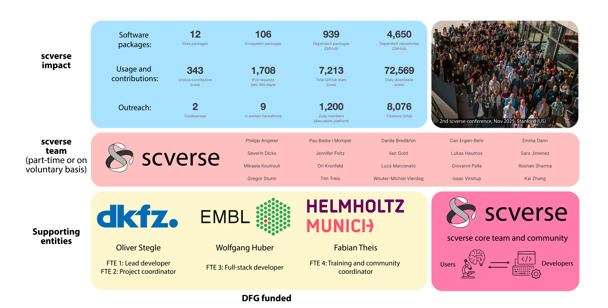

# scverse: bridging user and developer experiences for single-cell biology{.smaller}

<!-- For documentation of how to deploy on GitHub pages, see:
https://quarto.org/docs/publishing/github-pages.html
Here, I use the first option: Render to docs
-->

:::: {.columns}
::: {.column width="50%"}
**Users focus: scientific discovery**

- Benefit from easy installation & comprehensive documentation

**Developer focus: removing friction, maintainability**

- Templates (scverse cookiecutter), dependency management, CI/CD, automation

:::
::: {.column width="50%"}
**Bridge users ↔ developers**

- Online support, in-person events
- Developer as a teacher: scientists learn to develop, developers focus on real scientific needs
- Software interoperability: e.g. Python + R/Bioconductor (AnnDataR)
:::
::::

::: {.notes}
scverse bridges users and developers. For users, the goal is to let scientists focus on scientific discovery — with easy installation and comprehensive documentation. For developers, we remove friction through automation: CI/CD, the scverse cookiecutter template, and dependency management. The bridge between these two worlds is built through online support, in-person events, and a teaching philosophy where developers help scientists become developers themselves, and gather crucial feedback in the process. Software interoperability — for instance Python and R/Bioconductor via AnnDataR — ensures broad accessibility. As the operations figure shows, this pipeline flows from the core team maintaining 12 core packages, through hackathons and workshops with hundreds of participants, to thousands of developers producing tutorials and documentation, ultimately advancing scientific discovery.
:::

# scverse team composition and scientific impact

::: {.notes}
This slide shows our team composition and scientific impact. Until now, scverse has been run largely on a voluntary basis by the community. Thanks to DFG funding, we now have a dedicated team focusing on three pillars: core infrastructure development and maintenance, teaching and training, and outreach to the broader scientific community. In terms of software, we maintain 12 core packages, 106 ecosystem packages, 939 dependent packages and 4,650 dependent repositories on GitHub. We have 343 unique contributors to core packages, over 1,700 pull requests in the last year, more than 7,200 GitHub stars, and around 72,500 daily downloads. Community-wise, we have organized 2 conferences and 9 in-person hackathons, with 1,200 members on our Zulip discussion platform, and our tools have been cited over 8,000 times.
:::

# Networking and national infrastructure {.smaller}

:::: {.columns style="font-size: 1.3em;"}
::: {.column width="80%"}
**How can your project benefit from networking with other projects?**

- Share and learn from each other: what works, what doesn't
- Optimally exploit shifting paradigms and workflows from AI: e.g., hard and solid core methods, LLM-enhanced glue and user interfacing

**How can your project contribute to a national integrated structure for research software?**

- Broader collaboration on modular, reusable components for shared problems

**What should a national integrated structure for research software achieve?**

- European digital sovereignty to have the tools for doing the science we want to do
- Set the environment for sustainable scientific software development by both, professional RSEs and amateur developers who are PhD or postdocs in their main jobs --- through training, good incentives, research performance assessment, careers 

:::
::: {.column width="20%"}
{height="500px"}
:::
::::

::: {.notes}
Three questions to address. First, networking: we want to share and learn from each other — what works, what doesn't — and collectively navigate the shift that AI is bringing to our workflows, for instance by building tools for AI agents and making documentation LLM-ready. Second, contribution: we believe in reusing and contributing to modular, reusable components across projects, so we can support and advance each other's efforts rather than reinventing redundant tools that increase the maintenance burden. Third, the vision: a national integrated structure should enable us to work together towards end-to-end open, free scientific workflows. Concretely: for teaching and outreach, scverse will partner with de.NBI and Bioconductor; for reproducible workflows, with nf-core and Galaxy; and for bridging adjacent scientific communities such as bioimage analysis, with German BioImaging, IO-FAST and BioImage Archive.
:::
